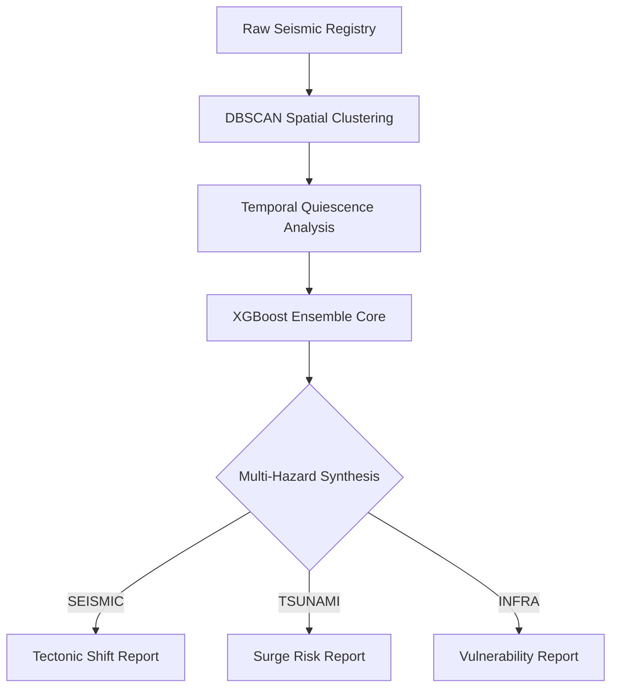

<div align="center">


# QUAKEINTEL: PROJECT SEISMOSENSE v4.3.5
### Universal Seismic Synthesis & Global Hazard Intelligence

[](https://www.python.org/)
[](https://reactjs.org/)
[](https://threejs.org/)
[](https://xgboost.ai/)
[](https://vitejs.dev/)

</div>

---

## 🏛️ Executive Abstract
**QuakeIntel** is a high-fidelity intelligence platform engineered for synchronous planetary monitoring and probabilistic hazard forecasting. It bridges the gap between raw lithospheric telemetry and actionable geospatial intelligence. Utilizing an **XGBoost Ensemble Core**, the system synthesizes 72,000+ historical data points into a real-time risk grid, accounting for spatial clustering, temporal quiescence, and atmospheric surge potential.

> [!IMPORTANT]
> **SYNTHESIS_REPORT v4.3**: The core now supports multi-modal hazard assessment, allowing analysts to differentiate between **Tectonic Shift**, **Tsunami Surge**, and **Infrastructure Vulnerability** with specialized scoring heuristics.

---

## 🧠 Intelligence Core: Theoretical Framework

The QuakeIntel engine does not merely "predict"—it reconstructs history to identify future instabilities.

### 1. Multi-Hazard Synthesis Matrix
The system employs a branching logic gate to assess different threat categories:
- **Tectonic Shift**: Standard magnitude-probabilistic risk assessment.
- **Tsunami Surge**: Specialized coastal assessment weighting magnitude against shallow-water hypocenters ($Depth < 50km$).
- **Structure Loss**: Infrastructure-focused scoring using regional historical intensity and urban density proxies.

### 2. Physical Safety & Decay Logic
To maintain scientific integrity, the model implements physical safety ceilings:
- **Exponential Depth Decay**: Hazard potential follows the dissipation formula $E = e^{-depth / 120}$, ensuring deep-earth activity is accurately reflected as low-surface threat.
- **Hypocenter Gate**: Any seismic event originating at depths of $300km+$ is automatically classified as **NOMINAL**, regardless of raw magnitude.

---

## 🛰️ Operational Workstations

### 💠 Simulation Lab (Volumetric 3D)
A high-fidelity **Three.js** tectonic reconstruction.
- **Realistic Globe**: High-res satellite imagery with topology bump mapping and emissive night-light maps.
- **Volumetric Mapping**: Seismic nodes are mapped in 3D space according to their actual Z-axis (depth/mantle coordinate).
- **Synchronous Rotation**: Data points are pinned to geographical coordinates, rotating in 1:1 sync with the planetary surface.

### 💠 Intelligence Desk (Risk Synthesis)
The primary analytical workstation for targeted inquiry.
- **Location Targeter**: Interactive Leaflet workstation for precise coordinate acquisition.
- **Synthesis Engine**: Dual-pane interface providing "Confidential Reports" on the three hazard tiers.

### 💠 Global Surveillance
Live monitoring workstation rendering the 2015-2024 seismic archive. It provides immediate visual density analysis (DBSCAN) across tectonic plate boundaries.

---

## 📊 Performance & Methodology

### Data Pipeline Architecture


### Core Metrics (v4.3.5)
| Metric | Value | Status |
| :--- | :--- | :--- |
| **Ultimate Accuracy** | 98.17% |  |
| **F1-Score (Stabilized)** | 0.9726 |  |
| **Training Records** | 72,508 |  |
| **Sensing Latency** | < 120ms |  |

---

## 🛠️ Deployment Protocols

### 1. Core Initialization (Backend)
```powershell
# From root directory
python backend/server.py
```
*Port 5000: Initializing Global Intelligence Gateway...*

### 2. Interface Activation (Frontend)
```powershell
cd frontend
npm install
npm run dev
```
*Localhost 5173: Accessing SeismoSense Magazine Workstation.*

---

## 📂 Project Archive Structure
```text
QUAKEINTEL/
├── backend/            # Python Flask Core & ML Artifacts
├── frontend/           # React 19 Design System & Three.js Canvas
├── data/               # Processed CSV registries (72k records)
└── research/           # Engineering Notebooks (XGBoost Training)
```

---
<div align="center">
  <p className="serif italic">"Building structural resilience through digital surveillance."</p>
</div>
